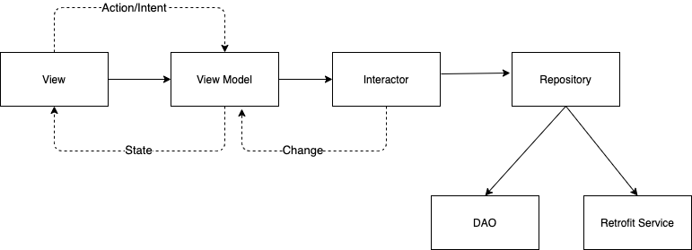

# ResourcesApp

Libraries
- Kotlin
- Coroutines
- Chanells & Flows
- Hilt
- Retrofit
- Glide
- Room
- Navigation Component
- Palette 
- MockK
- Espresso

Overview

This application displays data corresponding to two API endpoints:
- people: https://5f7c2c8400bd74001690a583.mockapi.io/api/v1/people
- rooms: https://5f7c2c8400bd74001690a583.mockapi.io/api/v1/rooms

All operations are performed by calling API endpoints over the network using Retrofit. In case of successful operations
data is stored in a local database using Room, being updated accordingly.
The domain model objects are used throughout the app. They are plain Kotlin objects, used for both newtork and persistence layer.

Persistency
- one database with two tables: Person, Room

Design

This application can be used on both phones and tablets, as well as on both orientations (portrait and landscape).
The Navigation Component manages the navigation between the main sections of the app (People & Rooms) using a BottomNavigationView. In landscape mode, the master
detail flow has been implemented. In portrait mode, the person details are shown on a different screen. 
In order to integrate each person's favourite colour, the Palette library has been used for a better UX and look&feel.

Architecture

This app follows the MVVM architectural pattern as well as MVI architectural pattern for a better testability. The following picture describes the architectural
components communicating in a unidirectional way.

